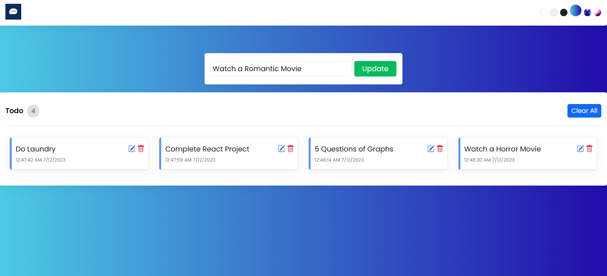

# TaskManager App

TaskManager App is a powerful and user-friendly task management application built with React. It allows users to efficiently manage their tasks by providing features such as adding, updating, and deleting tasks, along with customizable themes. The app utilizes local storage, useState, and useEffect hooks to ensure a seamless task management experience for every user.

## Key Features

- **Task Management**: Add new tasks, update existing tasks, and delete completed tasks, providing a comprehensive and organized approach to task management.
- **Theme Customization**: Customize the app's appearance by selecting from a range of different themes. Personalize the visual style of the app to suit your preferences.
- **Local Storage Integration**: The app uses local storage to persistently store tasks and settings. Your tasks will be accessible even after closing and reopening the application.
- **React Components**: The app is built using React, utilizing reusable and modular components for improved maintainability and code readability.
- **useState and useEffect Hooks**: Manage the app's state and handle side effects efficiently using the useState and useEffect hooks from React.
- **Deployment on Netlify**: The TaskManager app is seamlessly deployed on Netlify, allowing easy and secure access to the app through a live URL.

## Deployed Version

The TaskManager app is deployed and accessible online. You can try it out by visiting the following URL: [TaskManager App](https://taskmanager-shark.netlify.app)

## Contributing

Contributions are welcome! If you have any ideas, suggestions, or bug fixes, please open an issue or submit a pull request. Make sure to adhere to the existing code style and follow the contribution guidelines.

## Acknowledgements

The TaskManager app was created with the help of various open-source libraries, frameworks, and resources. We would like to acknowledge and express gratitude to the following:

- React: [https://reactjs.org](https://reactjs.org)
- Netlify: [https://www.netlify.com](https://www.netlify.com)

## Contact

If you have any questions, suggestions, or feedback, feel free to reach out to us at [shakeebparwez@gmai.com].

Happy task managing!